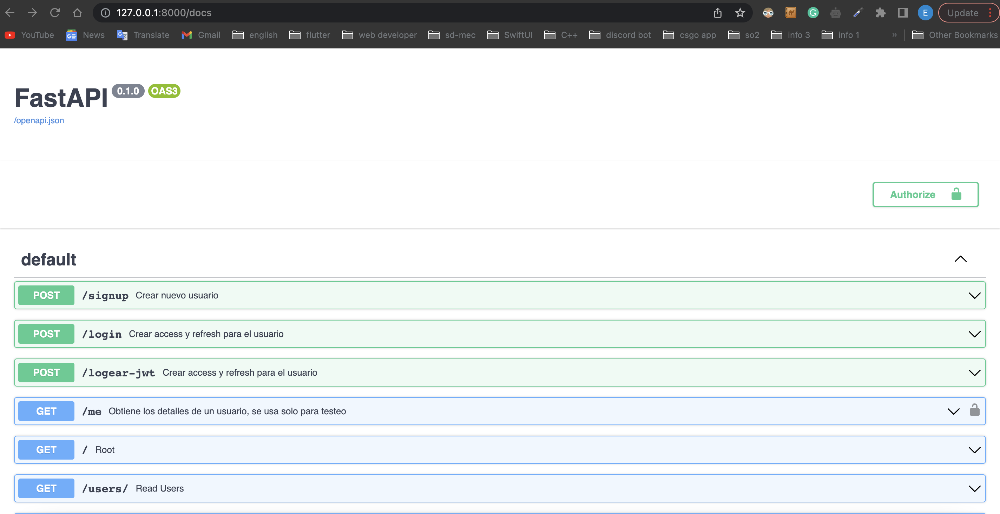
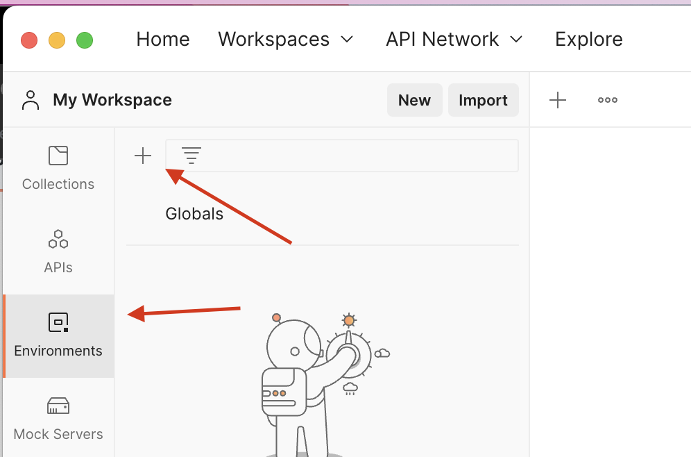
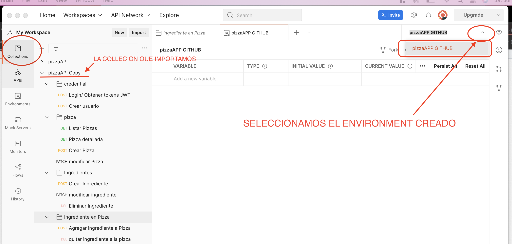
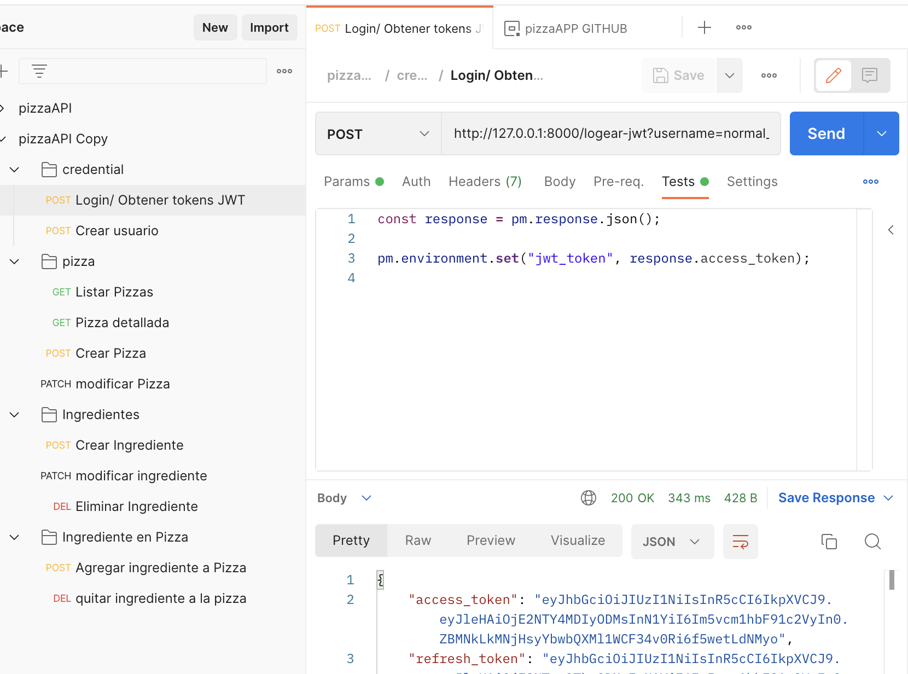
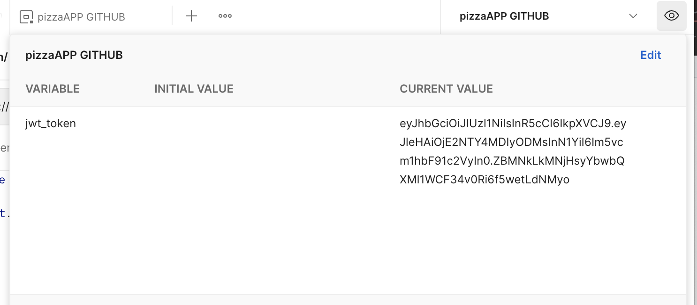
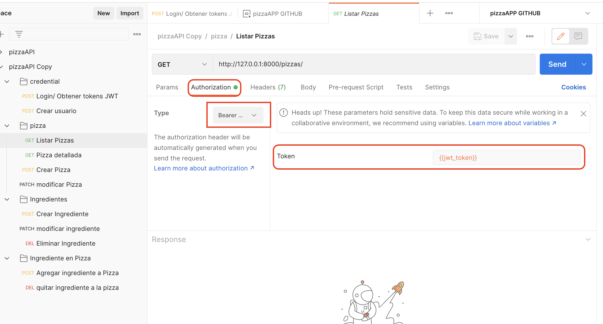
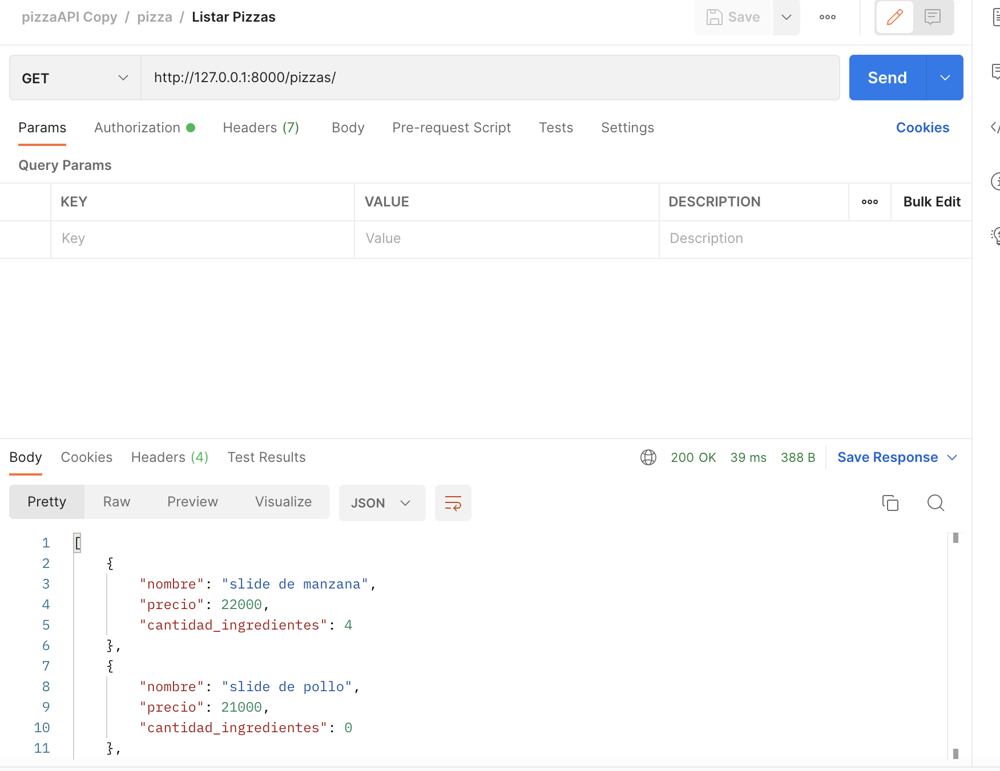
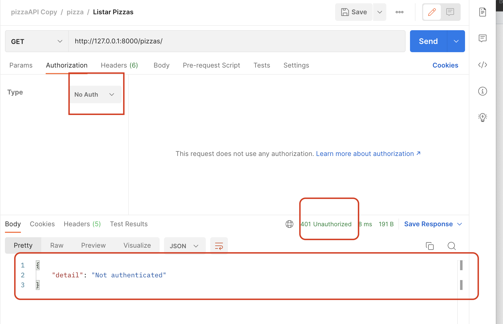

# pizzaTDP


# Requisitos
* Python 3.6 para adelante
* Sistema operativo Unix-like
* Pip

# Instalacion
1. Clonar el Repositorio

```bash 
$ git clone https://github.com/erwaen/pizzaTDP.git
```
<br>

2. Entrar en el directorio del proyecto
```bash 
$ cd pizzaTDP
```
Nota: desde ahora este directorio sera el directorio principal donde se debe ejecutar todos los comandos siguientes.
<br>

3. Mejor si se crea un entorno virtual
```bash 
/pizzaTDP $ python3 -m venv env
```
<br>

4. Activamos el entorno virtual
```bash 
/pizzaTDP $ source ./env/bin/activate
```
<br>

5. Instalamos las dependencias listadas en requirements.txt con pip
```bash 
(env) /pizzaTDP $ pip3 install -r requirements.txt 
```
<br>

# Correr el proyecto
Una vez ya realizado todo lo que esta en la seccion de instalacion, entonces ya deberiamos poder correr el proyecto.

Para correr el proyecto ejecutar:
```bash 
(env) /pizzaTDP $ uvicorn apiPizza.main:app --reload

INFO:     Will watch for changes in these directories: ['/Users/erikwasmosy/Developer/pizzaTDP']
INFO:     Uvicorn running on http://127.0.0.1:8000 (Press CTRL+C to quit)
INFO:     Started reloader process [39834] using watchgod
INFO:     Started server process [39836]
INFO:     Waiting for application startup.
INFO:     Application startup complete.
```
El proyecto esta alzado 127.0.0.1:8000 .
<br>
Para probar rapido que funciona podemos entrar a http://127.0.0.1:8000/docs

Y nos debe salir algo parecido a esto:


🥳 Ya tenemos el proyecto levantado.

# Base de datos
* En el repositorio se encuentra el archivo de unna base de datos(pizza_app.db) con datos ya cargdos.
* Para visualizar facilmente los datos que contiene podemos usar algun programa como DB BROWSER for  SQLite e importamos el archivo pizza_app.db

La base de datos ya tiene algunos usuarios para probar los endpoints

|  username          |     password    |    is_staff | is_superuser | 
| -------------  | -------------| --------- | --------- |
| normal_user  | 12345678   |    0    |  0   |
| staff_user  | 12345678   |    1    |  0   |
| superuser_user  | 12345678   |    0    |  1   |

<br>
<br>

# Uso de Postman para probar los endpoints
En el directorio raiz del proyecto se encuentra el archivo de la collecion para postman (pizzaApi.postman.json) para importarlo.

Como casi todas las rutas necesitan que este un usuario autenticado, debemos guardar el token JWT como una variable, para eso debemos:
1. Crear un ENVIRONMENT en postman


2. Volvemos a la seccion de <b>Collections</b> y asignamos el <b>environment</b> creado.


Entonces cuando intentemos usar el request de login/obtener tokens JWT y pasar uno de los usuarios mencionados en la seccion de base de datos, este postman request ya esta configurado para que una vez se haga la peticion en este request ya asigne el <i>access_token</i> en una variable llamada <i>jwt_token</i>.

Para que se asigne automaticamente el <i>access_token</i> en <i>jwt_token</i> se hizo la siguiente configuracion en la peticion:


y vemos que guarda automaticamente el token en la <i>jwt_token</i> del environment que creamos:


<b>Nota:</b> Si queremos testear funciones que solo el rol staff o superstaff  puede hacer entonces debemos volver a hacer la peticion para logearse en otra cuenta y asi se cambia el valor de la variable jwt_token con el token del usuario recien logeado. 

## Pasar Auth en las peticiones
Con la coleccion dada (./pizzaApi.postman_collection.json)  ya esta configurado para que use el token que contiene la variable <b>jwt_token</b> a la hora de verificar la autenticacion.

Si desea probar que pasa sin pasarle la autenticacion entonces en algun request debemos sacar el <b>Authorization</b> que usa.

* Ej de uso de authorization en una peticion:

y vemos que no hay problema a la hora de hacer requests


* Pero si sacamos el Auth vemos que nos responde con un 401 unauthorized:



<br><br>

# Endpoints

<b>NOTA:</b> Algunos endpoints se pasan sus valores como paramentros y otros como Body de tipo row(JSON)

|  Path          |     Query    |    Method | Description | 
| -------------  | -------------| --------- | --------- |
| /logear-jwt  | username: str, password: str   |    <b style="color:Fuchsia;">POST</b>    |  Login para autenticacion con JWT, retorna los tokens access_token y refresh_token.   |
| /signup  | body(JSON) {<br>"username": "",<br>password": ""<br>"is_staff": true,<br>"is_superuser": false"<br>}    |    <b style="color:Fuchsia;">POST</b>    |  Para crear un nuevo usuario y asignarle un rol.  |
| /pizzas/    |    | <b style="color:LawnGreen;">GET</b>       | Retorna todas las las pizzas activas con su nombre, precio y numero de ingredientes que tiene. Si el user es staff o superuser entonces tambien retorna las no activas. |
| /pizzas/{pizzaID}    |  pizzaID: int  | <b style="color:LawnGreen;">GET</b>       | Retorna los detalles de la pizza mostrando el nombre, precio, si esta activo o no y sus ingredientes |
| /pizzas/    | bodyExample(JSON){<br>"nombre": "brasilera",<br> "precio": 10000,<br>"is_active": true<br>}   | <b style="color:Fuchsia;">POST</b>       | Crea una nueva pizza dado en el body su nombre, precio y si va a estar activa o no. |
| /pizzas/{pizzaID}    |  nombre: str<br>precio: str<br>is_active: bool  | <b style="color:gray;">PATCH </b>       | Modifica la pizza con id pizzaID con los valores que se le pasa como parametros |
| /ingredientes/    |  bodyExample(JSON){<br>"nombre": "choclo",<br>"categoria" : "basico"/"premium"<br>}  | <b style="color:Fuchsia;">POST</b>       | Para crear un nuevo ingrediente pasandole el body el nombre y la categoria (la categoria se controla que sea solo "basico" o "premium") |
| /ingredientes/{ingredienteID}    |  bodyExample(JSON){<br>"nombre": "pinha",<br>"categoria" : "basico"/"premium"<br>}  | <b style="color:gray;">PATCH </b>      | Modifica el ingrediente con id ingredienteID con los valores que se le pasa en el body |
| /ingredientes/{ingredienteID/   |  | <b style="color:red;">DELETE</b>       | Elimina un ingrediente de la base de datos y antes controla que ninguna pizza use ese ingrediente |
| /pizza-ingrediente/   | p_id: int<br>ingr_id: int |  <b style="color:Fuchsia;">POST</b>       | Agrega el ingrediente con id ingr_id a la pizza con id p_id |
| /pizza-ingrediente/{p_id}/{ingr_id}   |  |   <b style="color:red;">DELETE</b>      | Elimina un ingrediente con id ingr_id de la pizza con id p_id  |